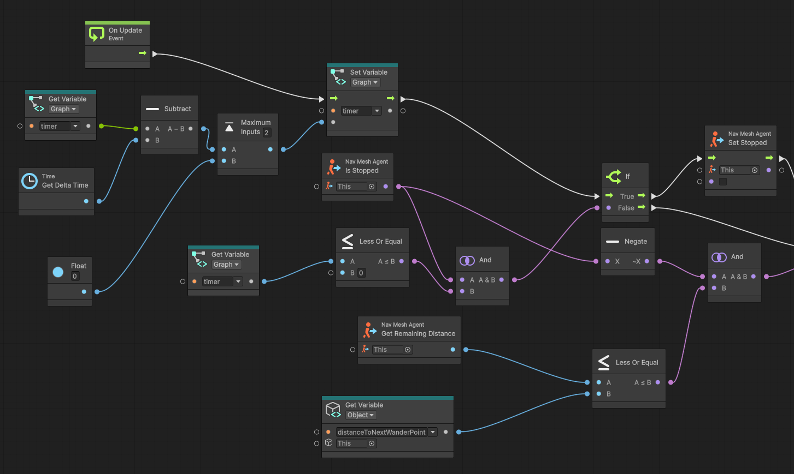
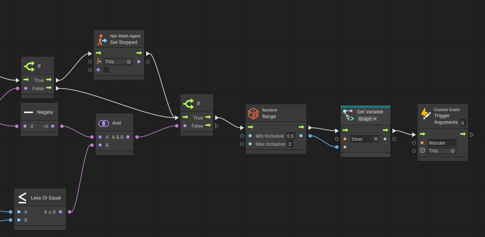
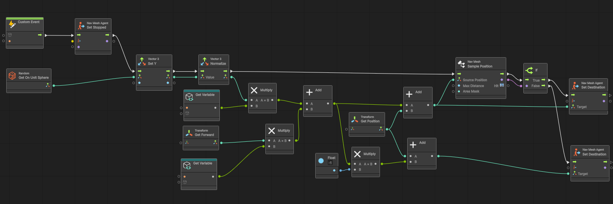
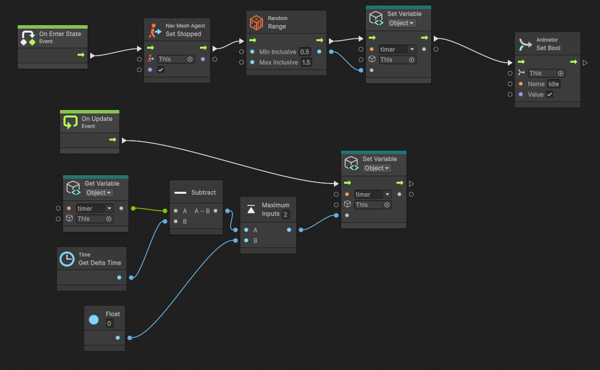
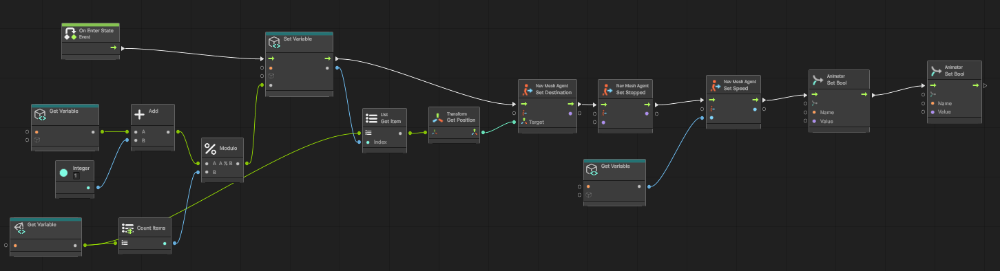
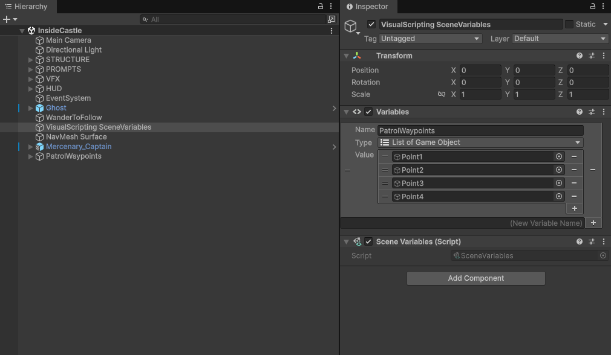
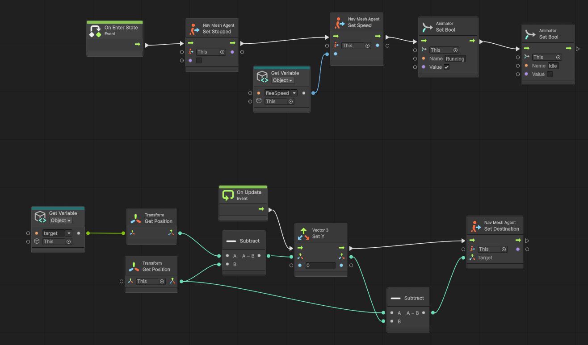
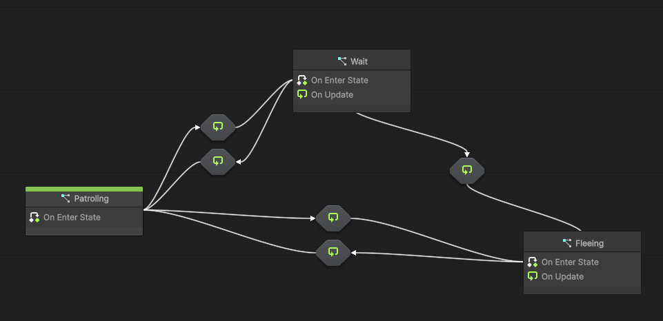
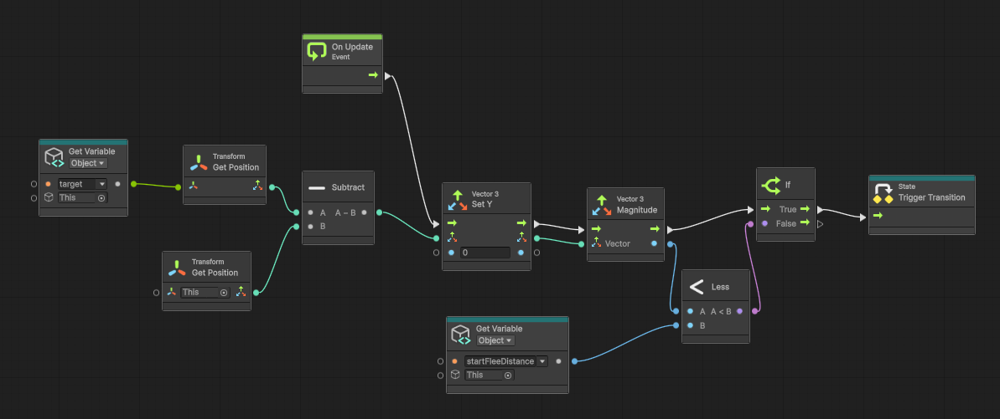
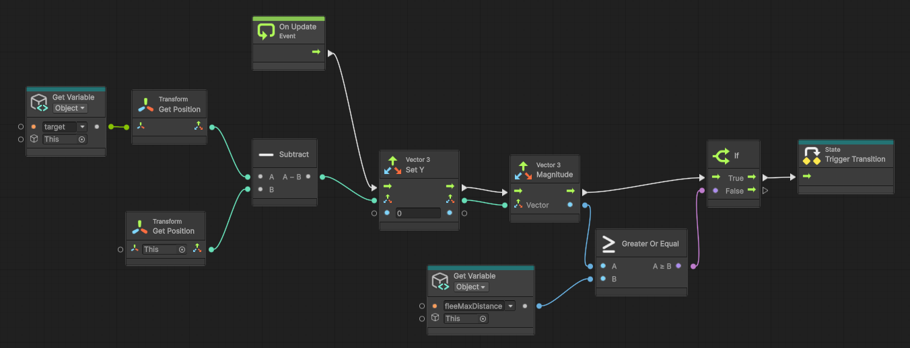

# NPC BEHAVIOUR
## Wandering
Achieving a realistic behaviour with smooth movement requires careful handling of several decisions. The first is to define random routes that feel like genuine wandering, complemented by steering movement and random pauses between waypoints to make the NPC feel alive. The behaviour is implemented with NavMeshAgent and Visual Scripting. A low velocity and smooth acceleration produce a more organic movement than purely kinematic motion, although the result can still feel somewhat robotic.

To make the behaviour feel more natural, a random pause between two configurable values makes the NPC appear to wander and observe the environment, although the result is still not as satisfactory as intended. A useful trick that smooths directional changes and sharp pathing is to attach this behaviour to an empty GameObject and have the real NPC follow that object. The movement then feels much more natural than before.

Path selection is equally important, so Reynolds' wander circle is used to keep the movement continuous. When a new path is chosen, the NavMesh is queried to check whether it lies inside the walkable area (with an error margin called Max Distance). If the chosen path is out of bounds, the opposite direction is assigned. This decision prevents the NPC from getting stuck in corners or walls.

	

## Patrolling
Patrolling requires several waypoints and a wait time once the NPC reaches its destination. To do so, I reused the same timer solution as the ghost. Selecting the next waypoint is the other key decision; I preferred to select it every time the agent starts patrolling, so that when fleeing from the ghost the agent avoids getting stuck in a walking/fleeing loop because the ghost is in the way.

The patrol route is stored as a scene variable list, as shown below.

## Fleeing
To make fleeing feel more realistic, the agent checks the target position (the ghost) on every update and runs in the opposite direction. To achieve this, and to convey that the NPC is genuinely frightened, I added two velocities: a patrol velocity and a fleeing velocity. Both are assigned when the new NPC state is set, handled by the FSM. Those states also handle the animation state so the character behaves as expected: Run, Idle and Walk.

## Finite State Machine (FSM)
This is the most important part of the behaviour management: here the character chooses how to behave, switching between actions once the correct conditions are reached.

When state transitions work as intended, the subgraphs handle the rest of the behaviour. If new actions are needed for different conditions later, they can be added there without breaking the current behaviour.

	

## Generative AI
I used generative AI to solve some problems. For example:
 
<b> Prompt: </b>
Estoy trabajando con el visual scripting y estoy creando un vector Z = 1 para moverme en dirección Z, pero me estoy dando cuenta de que me lo está creando en Z World y yo lo que necesito no es Z World, es Z local y luego transformarlo a mundo.

<b> Result: </b>
En Visual Scripting de Unity tienes tres formas de resolver esto dependiendo de cómo estés aplicando el movimiento:

---

### Opción 1: Usar directamente `Transform: Get Forward` *(La más limpia)*

No necesitas construir el vector `(0, 0, 1)` manualmente. El eje Z local de un objeto equivale a su dirección "hacia adelante" (*Forward*).

1. Abre el Fuzzy Finder en tu Graph y busca: **Transform: Get Forward** (o simplemente **Forward**).
2. Conecta la salida de este nodo directamente a la dirección de tu movimiento.

Este nodo toma el vector `(0, 0, 1)` local del objeto y automáticamente lo entrega transformado a coordenadas del mundo.

---

### Opción 2: Convertir un Vector3 Local a Mundo (`Transform Direction`)

Si necesitas crear tu propio `Vector3(0, 0, 1)` personalizado y transformarlo a espacio de mundo:

1. Crea tu nodo **Vector3 Create** con $Z = 1$.
2. Añade el nodo **Transform: Transform Direction** (busca `Transform Direction`).
3. Conecta:
* **Target:** Tu objeto (por defecto `Self`).
* **Direction:** La salida de tu **Vector3 Create**.

4. La salida de **Transform Direction** te dará ese vector ajustado a la rotación actual de tu objeto en el mundo.

---

### Opción 3: Si estás usando el nodo `Transform: Translate`

Si estás moviendo el objeto directamente con el nodo **Transform: Translate**:

1. En el propio nodo **Transform: Translate**, busca el parámetro **Relative To** / **Space**.
2. Cámbialo de **World** a **Self**.
3. De esta forma, el vector `Vector3(0, 0, 1)` moverá al objeto en su propio eje Z local sin necesidad de convertir el vector a espacio de mundo manualmente.

